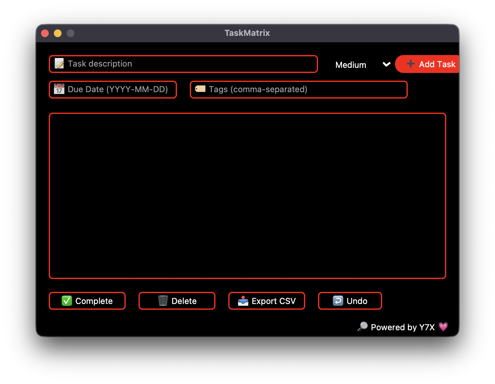

<div align="center">

# 🖤 TaskMatrix  
**Minimal chaos. Maximum control**

TaskMatrix** is a minimalist, glowing to-do list app designed for modern productivity.  
It blends clean task management features with a sleek AMOLED interface powered by red outlines and white-on-black contrast.
Branded with 💗 by [Y7X-bit](https://github.com/Y7X-bit)



</div>

---

## 🌟 Features at a Glance

- ✅ Task creation, deletion & completion
- 🧠 Priority levels + tags + due dates
- 🔁 Undo last action
- 📤 Export to CSV
- 🖤 AMOLED UI with red outlines & white text
- 💾 Persistent save via JSON
- 🔎 Branded: **Powered by Y7X 💗**

---

## 🖥️ Installation

> Python 3.9 or later required

```bash
git clone https://github.com/Y7X-bit/TaskMatrix.git
cd TaskMatrix
pip install -r requirements.txt
python TaskMatrix.py